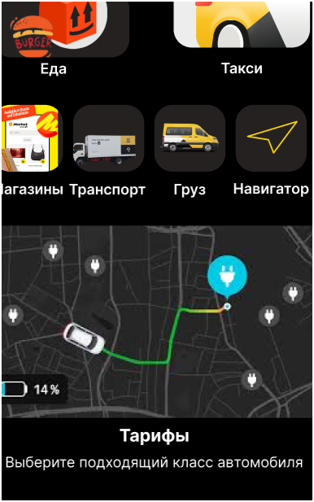

# 🚕 Taxi Mobile Application (Java / Android)

Мобильное приложение для онлайн-заказа такси и управления поездками, разработанное на Java. Дизайн интерфейса выполнен в фирменной контрастной теме (Dark / Yellow Theme).

## 🎨 Интерфейс мобильного приложения (UI/UX Design)

| Главный экран | Выбор маршрута и тарифа | Подтверждение заказа |
| :---: | :---: | :---: |
|  |  |  |

## 🚀 Основной функционал

**Заказ такси:** Ввод маршрута (А ➔ В) с автоматическим расчётом стоимости поездки.
**Выбор класса:** Эконом, Комфорт, Бизнес.
**Отслеживание статуса:** Отображение этапов («Поиск водителя», «Водитель в пути», «Завершён»).
**Управление заказами:** Просмотр истории и активных поездок.
## 🛠 Технологический стек

**Язык программирования:** Java (JDK 17+)
**Архитектура:** ООП (Объектно-ориентированное программирование), MVC
**Платформа:** Android / Java Swing
